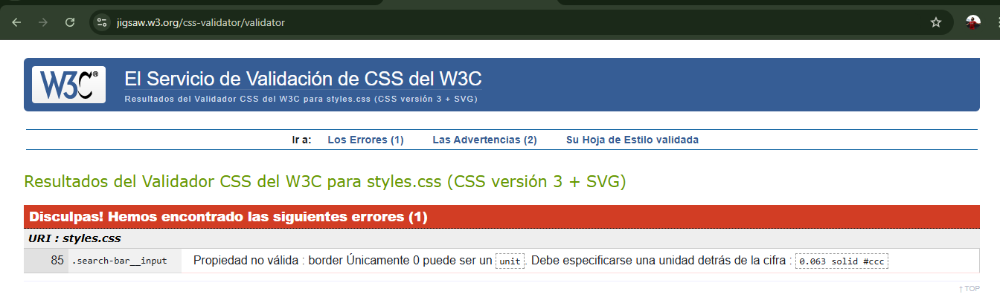
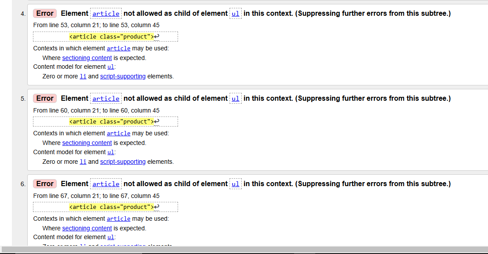

# Raiders Zone

¡ Bienvenido a Raiders Zone! Este es tu lugar si te gusta las motocicletas, donde encontrarás: Modelos premium, accesorios exclusivos,
eventos y mucho mas.

# En que consiste mi proyecto

Pues hemos creado una Pagina web con cuantro secciones principales diferenciadas:

1.Página Principal: Un vistazo en general de lo que ofrece Raiders Zone, con destacados con comentarios de nuestra comunidad y productos exclusivos, desde 

2.Servicio: Un catalogo donde encontraras motos, accesorios y ropa que te harán querer disfrutar de la pasión de las motos.

3.Contacto: Una página para escribir vuestros problemas, poder contactar con nosotros o escribirnos para conoceros.

4.Eventos: Una sección de actividades si eres un apasionado a las motocicletas.

# Estructura de una página

## HTML

El html es el lenguaje base para estructurar contenido en la web, funciona como el esqueleto de tu sitio, definiendo que elementos aparecen y como estan organizados

## Etiquetas utilizada
- Header : El encabezado de la pagina, que contiene el logo, menú de navegación, el dark mode y la barra de busqueda
- main : Contiene el contenido principal de la página
- footer : El pie de página, donde esta colocado los derechos de autor
- section : Lo que divide el contenido en bloques, como "Productos", "Consejos" o "Detalles de contacto"
- article : Es lo que contiene el contenido inpendiente como las descripciones de los productos
- img : Muestra las imagenes, y utilización de atributos como src (que es la ruta de la imagen) y alt (descripción de la imagen).

### Como optener buenas practicas 

- Comentarios utiles dentro del código, para que sepas en que consiste cada apartado.
- Validación todo con W3C Validator para no cometer errores.
- Usar etiquetas que describan claramente el proposito de cada sección.

## CSS

El css es el lenguaje que controla el estilo y diseño visual del HTML, que define como se ve los elementos dentro de la página Web.

### Caracteristicas del Css en mi proyecto

- Metodologia BEM: Dividimos las clases en bloques, elementos y modificadores para mantener claridad y consistencia.

- Responsive Desing: Usamos media queries para adaprtarlo a otras plataforma con doferentes tamaño de pantalla.

  @media (max-width: 768px) {
    .nav__list {
        flex-direction: column;
    }
}

 - Variable Css: Usamos variables para mas consistencia.

   :root {
    --primary-color: #ff4500;
    --background-dark: #1a1a1a;
    --font-size-base: 16px;
}
body {
    color: var(--primary-color);
    background-color: var(--background-dark);
}

- Dark Mode: Cambio entre modo oscuro y modo claro

   body.dark-mode {
    --background-dark: #ffffff;
    --primary-color: #000000;
}

- Animaciones y transiciones : Agregamos animaciones suaves para mejorar la visibilidad del que vea tu pagina web.

  .button {
    transition: background-color 0.3s ease;
}
.button:hover {
    background-color: var(--primary-color);
}

### Buenas praticas de Css
- Todo estara centralizado a un mismo css para tener consistencia y todo bien ordenado siguiendo una metodologia BEM.
- Usaremos variables para colores,fuentes y tamaños.
- Evitar repetir propiedades con el uso de variables y clases reutilizables.
- Documentar el código para su comprensión
  

## Herramientas utilizadas

Visual Studio Code,
Git/Github

## Validacion

- Todos los html y los css han sido validados para garantizar la calidad del código con W3C Validator.
- Realizamos pruebas en distintos navegadores para que la página este bien implementada.

# Como poder ver tu mismo la Página

1. Clonaremos este repositorio
   git clone <URL_del_repositorio>
2. Te desplazaras hasta la carpeta del proyecto
   cd raiders-zone
3. Abre el archivo clonado en el navegador que te apetezca (Mi caso es Firefox)
4. Explora todas las secciones que hay en esta pagina utilizando el menu de navegación

# Validación de CSS

### El error a sido que no le he puesto el formato, para arreglarlo lo unico que debia hacer es poner rem y fin.

# Validación HTML

### El error a sido que he estado utilizando un article como el hijo de un ul y unicamente los hijos de ul solamente pueden ser los li y para solucionarlo deberemos meter el article dentro de un li para arreglarlo y como asi unos cuantos mas pero colocandolo bien se arregla el error.

